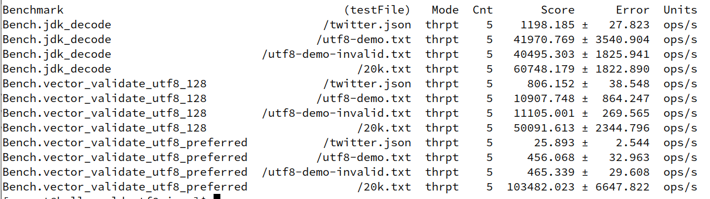
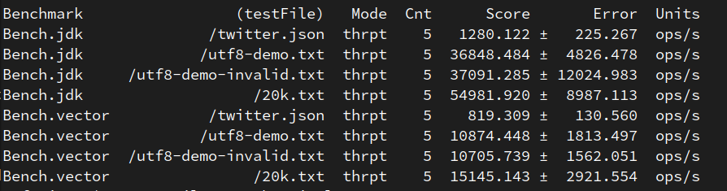

# utf8.java

Vectorized UTF-8 validation & benchmarks, written in Java. 

Based on the [paper by John Keiser and Daniel Lemire](https://arxiv.org/abs/2010.03090),
with minor modifications.

## Verify Correctness
Make sure to have Java 17 or greater installed. Then execute:

```bash
mvn compile assembly:single && \
java --enable-preview --add-modules jdk.incubator.vector \
-jar target/utf8.java-<version>.jar [optional list of space-delineated file paths]
```

With no arguments, this will run the UTF-8 validator on 4 source files:
  - twitter.json: 620_000 bytes, frequent multi-byte characters.
    Taken from [here](https://raw.githubusercontent.com/simdjson/simdjson/master/jsonexamples/twitter.json).
  - utf8-demo.txt: 16_000 bytes, many special / tricky utf8 characters. From
    [w3.org](https://www.w3.org/2001/06/utf-8-test/UTF-8-demo.html).
  - utf8-demo-invalid.txt: same as utf8-demo.txt, but with one error.
  - 20k.txt: 3.8 MB, all ascii.

## Running Benchmarks

```bash
mvn verify && java -jar target/benchmarks.jar "Bench"
```

The JMH benchmarks use the same 4 test files mentioned above, at 2 vector lengths: 128 bit, and
the platform's 'PREFERRED' width (the max supported on your system).`jdk_decode` uses the JDK's
`new String(buf, UTF_8)`. This constructor
does more than validation, but is good enough for a baseline.

## Performance

The JDK algorithm is very optimized, and uses intrinsics to check negatives
(for the ASCII shortcut) and to elide array bound checks.
On my computer, `new String(bytes, UTF_8)` can decode
the all-ASCII `20k.txt` at **9.4 GB/sec**, and **.8 GB/sec**
for the mixed `twitter.json` file.

In the vectorized algorithm, 128 bit vectors perform best. That makes sense because
the smaller the vector size, the more likely you can use the ASCII fast path.
We cannot go smaller than 128 bit, since nibbles (4 bits) are used to select from
the lookup tables.

The overall performance for vectors is not great; they're moderately worse
than the intrinsified & presumably auto-vectorized scalar. It's not a huge worry, the vector api is brand new.
I welcome ideas to improve the implementation.

Keiser and Lemire achieve 24 GB/sec with their C++ program, a 15x improvement over
their 'branchy' benchmark, which is about the same as the JDK.

Some things I tried (but failed to improve results) include:
- Removing ByteVector and using IntVector instead with SWAR techniques (more instructions.. more slow)
- Using SWAR to avoid creating VectorMask<Byte> that are immediately converted back to Vectors. (no change)
- Manually unrolling to remove data dependency (no change)
- Making sure data is aligned with MemorySegments: `ByteBuffer buf = MemorySegment.allocateNative(640_000, 16).asByteBuffer();`
  (slower than array).

Results from 2020-12-20:



After breaking up the code into JMH microbenchmarks, I noticed two problems. Despite only having 1 branch (for the ASCII fast path), bad branch prediction was destroying performance. I posted the "OneBranchTooMany.java" benchmark to the panama-dev mailing list, and Vladimir Ivanov (a legendary developer) [had a fix merged within 6 hours](https://mail.openjdk.java.net/pipermail/panama-dev/2020-December/011651.html). Yeah, two days before Christmas. This significantly improved performance, and is something everyone using the vector api will benefit from. Thank you Vladimir!

Another hot spot was ByteVector::slice. When I first benchmarked it was 'naievly implemented' by boxing the vectors to arrays and using a sequential algorithm. Now, it is implementing with vectors using an iota shuffle. However, this is still much slower than the two AVX instructions simd-json uses. Their rotation method only works for a few numbers, in one direction. So the vector api cannot simply take it up.

Anyway, three months later I've re-built the vectorIntrinsics branch of the [OpenJDK repo](https://github.com/openjdk/panama-vector) and re-ran the benchmark (for only the jdk & 128 bit cases). Here are the new results after testing on 2021-3-01:



Either I've built the wrong code (I did ask on the mailing list), or there's been some performance regressions.

## Conclusion

  - The Vector api is expressive and a pleasure to use.
  - Abstracting over ISA and even vector Shape is *incredible* for
    portability, given how fragmented vector instruction sets are.
  - The dissonance between Vector<Byte> and ByteVector is a little annoying.
  - If I had benchmarked iteratively while developing, I could've discovered the causes
    of slowdown sooner.
  - I wish there was a (documented) debug/logging flag.
  - Vector::selectInto is awesome for lookup tables.
  - The project's [JavaDoc](https://download.java.net/java/early_access/jdk16/docs/api/jdk.incubator.vector/jdk/incubator/vector/package-summary.html) 
    is one of the best introductions to vectorization on the internet.
  - Debugging works great! I do wish we could make Vector::toString print
    hex instead of base 10 by default.
  - Would have been nice if performance was a success story, but failure is educational.
  - I think someone could implement simd-json in Java if they wanted to. Would it be fast? At least not for now.

